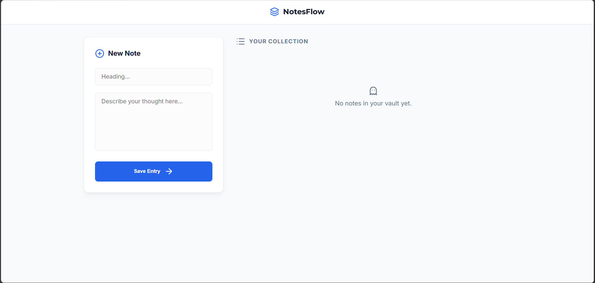
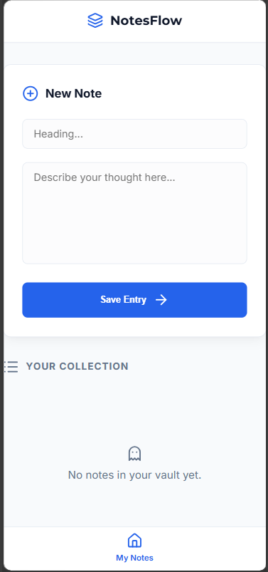

# NotesFlow Pro 🚀

[](https://github.com/username/notesflow-pro) [](https://opensource.org/licenses/MIT) [](https://github.com/username/notesflow-pro/releases)

**Premium Notes Management Web App**  
*Enterprise-grade UI with Glassmorphism • Full CRUD Operations • MongoDB Atlas • Built during Techno Hacks Internship*

---

## 🌟 About the Project

**NotesFlow Pro** is a production-ready notes management application built with modern web technologies. Developed during my internship at [Techno Hacks](https://technohacks.in/), it features a premium glassmorphism UI, seamless CRUD operations, and robust full-stack architecture.

**Key Highlights:**
- Mobile-responsive design (desktop + mobile nav)
- Auto-timestamping for all notes
- Enterprise-grade error handling & optimistic updates
- Live icons powered by Lucide Icons
- Deployment-ready (Vercel Frontend + Render Backend)

---

**Developed by: Naitik Kushwaha**  
👨‍💻 *Founder @ [Vornix Developers](https://vornix.dev)* | 🎓 *3rd Year AI/ML Engineering @ UCOE* | 💼 [Portfolio](https://naitik.dev) | 📧 naitik@vornix.dev

---

## 🛠 Tech Stack

| Frontend | Backend | Database | Tools |
|----------|---------|----------|-------|
| HTML5, CSS3 (Glassmorphism) | Node.js, Express.js | MongoDB Atlas (Mongoose) | Lucide Icons, Vite |
| Vanilla JavaScript (ES6+) | | | Vercel, Render |

---

## 📁 Folder Structure

```
notes-management-app/
├── client/                          # Vite + Vanilla JS Frontend
│   ├── index.html                  # SPA Entry Point
│   ├── vite.config.js              # Dev Server + Proxy
│   ├── vercel.json                 # Vercel Config
│   ├── css/
│   │   └── styles.css              # Glassmorphism UI
│   ├── js/
│   │   └── main.js                 # CRUD Logic + API Calls
│   ├── assets/                     # Images & Icons
│   └── package.json
├── server/                         # Express + MongoDB Backend
│   ├── server.js                   # Express App
│   ├── package.json                # Backend Dependencies
│   ├── render.yaml                 # Render Deployment
│   ├── config/
│   │   └── database.js             # MongoDB Connection
│   ├── controllers/
│   │   └── noteController.js       # Business Logic
│   ├── middleware/
│   │   └── errorHandler.js         # Error Handling
│   ├── models/
│   │   └── Note.js                 # Mongoose Schema
│   └── routes/
│       └── noteRoutes.js           # REST API Routes
├── README.md                       # 📖 You're here!
├── TODO.md                         # Progress Tracker
└── .gitignore
```

---

## ✨ Features

- ✅ **Full CRUD Operations**: Create, Read, Update, Delete notes with validation
- 📱 **Mobile-Responsive Design**: Sidebar + bottom nav for mobile
- 🎨 **Premium Glassmorphism UI**: Backdrop blur, hover animations, premium shadows
- ⏰ **Auto-Timestamping**: Created dates with human-readable formatting
- 🛡️ **Enterprise Security**: XSS protection, input sanitization
- ⚡ **Optimistic Updates**: Instant UI feedback + retry logic
- 🔔 **Toast Notifications**: Success/error feedback
- 🚀 **Production-Ready**: Env vars, CORS, error middleware

---

## 📸 Screenshots

### Dashboard View

*Premium glassmorphism cards with live data*

### Mobile View

*Optimized for all screen sizes*

---

## 🚀 Installation Guide

### Prerequisites
- Node.js >= 18
- MongoDB Atlas account (free tier)

### 1. Clone & Install Backend
```bash
cd server
npm install
cp .env.example .env  # Add your MONGO_URI
npm start
# Server running: http://localhost:5000
```

### 2. Install Frontend
```bash
cd ../client
npm install
npm run dev
# App running: http://localhost:5173
```

---

## 🔑 Environment Variables

### Backend (server/.env)
```env
MONGO_URI=mongodb+srv://<user>:<pass>@cluster.mongodb.net/notesflow_pro?retryWrites=true&w=majority
PORT=5000
FRONTEND_URL=http://localhost:5173
```

### Frontend (client/.env)
```env
VITE_API_BASE=/notes  # Dev proxy
# VITE_API_BASE=https://your-backend.onrender.com/notes  # Production
```

---

## 📋 API Documentation

**Base URL**: `http://localhost:5000`

| Method | Endpoint          | Description              | Request Body                  |
|--------|-------------------|--------------------------|-------------------------------|
| `POST` | `/notes`          | Create new note          | `{"title": "string", "content": "string"}` |
| `GET`  | `/notes`          | Get all notes            | -                             |
| `GET`  | `/notes/:id`      | Get single note          | -                             |
| `PUT`  | `/notes/:id`      | Update note              | `{"title"?: "string", "content"?: "string"}` |
| `DELETE` | `/notes/:id`    | Delete note              | -                             |

**Sample Response**:
```json
{
  "success": true,
  "message": "Note created successfully",
  "data": {
    "_id": "64f...abc",
    "title": "Sample Note",
    "content": "Premium notes app...",
    "created_at": "2024-10-01T12:00:00Z"
  }
}
```

---

## ☁️ Deployment

### Frontend (Vercel)
```bash
cd client
npm install -g vercel
vercel --prod
```

### Backend (Render)
1. Push to GitHub
2. Render.com → New Web Service
3. Connect repo → Add `MONGO_URI` & `FRONTEND_URL`
4. Auto-deploys via `render.yaml`

Update `VITE_API_BASE` in Vercel env vars to your Render URL.

---

## 🧪 Testing

```bash
# Backend Health Check
curl http://localhost:5000/api/health

# Create Note
curl -X POST http://localhost:5000/notes \\
  -H "Content-Type: application/json" \\
  -d '{"title":"Test","content":"Test content"}'
```

---

## 🔍 Troubleshooting

| Issue | Solution |
|-------|----------|
| CORS errors | Set `FRONTEND_URL` in backend .env |
| MongoDB connection | Verify `MONGO_URI` & whitelist IP |
| API 404 | Check proxy in `vite.config.js` |
| Icons not loading | Ensure Lucide CDN/script |

---

## 📈 Contribution

1. Fork the repo
2. Create feature branch (`git checkout -b feature/AmazingFeature`)
3. Commit changes (`git commit -m 'feat: add amazing feature'`)
4. Push & PR

---

## 📄 License

This project is [MIT](LICENSE) licensed.

---

*Built with ❤️ during Techno Hacks Internship | © 2024 Naitik Kushwaha | [Vornix Developers](https://vornix.dev)*


